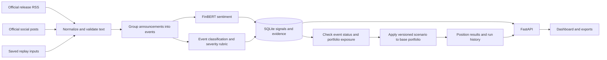

# EventLens project plan

## Capability

- Product: EventLens.
- Submission: S&P Global and Crisil Campus Hackathon 2026, Code to Connect Phase III.
- Candidate: Abhinav Jain.
- College: Vellore Institute of Technology, Bhopal.
- College email for submission: abhinav.23bcg10130@vitbhopal.ac.in.
- Current repository: https://github.com/Abhinav-0311/EventLens.
- Primary actor: a wholesale-banking portfolio risk analyst.
- Outcome: trace an incoming text event through structured risk intelligence to an explained portfolio stress result.
- Selected scope: required AI/NLP Risk Engine plus Module B, Strategic Portfolio Stress Testing.
- Status: Phases 1–4 complete on 5 October 2026 IST; Phase 5 engineering evaluation/refinement and isolated clean-install checks complete. Backend, stress calculations and dashboard are verified. Phase 7 presentation/recording preparation, authorized publication and actual anonymous published-clone checks are complete. Candidate-reviewed labels, walkthrough, model/data notices, naming/cutoff and recording/submission gates remain. This is not submission-ready or independently validated for autonomous risk decisions.

## Product intent and module decision

An analyst should be able to answer: what happened, what evidence supports it, which positions are exposed, and what changes under an explicit stress scenario? The main demonstration follows one event through that entire sequence, with a low-impact event and a duplicate announcement as counterexamples.

Module A is feasible as a sentiment-to-weight demonstration. A credible high-frequency strategy, however, introduces timing, turnover, transaction costs, weight constraints, and out-of-sample backtesting. The brief permits a mock strategy; EventLens should not imply that changing weights proves an investment advantage.

Module B better supports the assignment's banking use case and its domain-understanding tie-breaker. It still needs careful units, different treatment of asset types, and transparent assumptions. A scenario result is conditional on those assumptions; it is not a forecast of actual losses.

Do one downstream module well. Module A is excluded from the first submission scope.

## Fixed submission constraints

- Accept text from at least two different sources.
- Return sentiment in [-1, 1], event classification, and impact score in [1, 10].
- Expose structured signals through an API and provide an export for review.
- Build a synthetic portfolio containing loans, bonds, and derivatives.
- Trigger a supported stress test when impact score exceeds 7 and evidence and exposure checks pass.
- Provide a working dashboard, public source repository, license, dependencies, reproducible Quickstart, and architecture diagram.
- Include CSV/JSON inputs used for the submitted demonstration under data/ and document sources and assumptions.
- Slides: 5-7, with a PDF in docs/presentation.pdf.
- Recorded submission video: 5-10 minutes, confirmed by the organizer's email supplied by the user. Target 6-7 minutes.
- Prepare a live demonstration of at most 5 minutes, as stated by DoSelect.
- Deadline: 11 October 2026. Exact cutoff time/timezone has not been supplied; aim to finish submission checks on 10 October.
- Individual submission. AI assistance is allowed under the supplied guidelines; the candidate must understand and explain the submitted work.
- Use public or synthetic inputs; include source attribution and distinguish third-party data/model licenses from the project's code license.
- Repository naming: the guideline prescribes <college>-<candidate-name>-hackathon. EventLens is the product title; current repository name deviates from that convention. Resolve before submission.

## Data and source feasibility

Read-only probes from this workspace on 4 October 2026 established the source paths below. A rerun at 2026-10-04T19:42:18Z (5 October, 01:12 IST) reconfirmed Federal Reserve RSS (20 records), official Bluesky (5 nonempty posts), the pinned FinBERT manifest, and the BLS 403 response. Keyword-search and GDELT results remain the earlier probes, not refreshed availability claims.

| Source path | Result | Implementation consequence |
| --- | --- | --- |
| Federal Reserve press-release RSS | HTTP 200; 20 items parsed; Python XML parser accepts the raw byte response | Candidate live official-text source |
| Official Federal Reserve Bluesky author feed | HTTP 200; 5 posts returned without credentials | Candidate live social-text source |
| Bluesky public keyword search | HTTP 403 | Do not make keyword search a default dependency |
| GDELT DOC article search | HTTP 429 | Optional news adapter with caching, bounded retries, and backoff; availability must be retested |
| BLS CPI release feed (additional Phase 1 probe) | HTTP 403 | Independent publisher candidate, but unavailable from this environment; do not count as a working source |

The Federal Reserve website links to its official Bluesky account. The two working channels prove technical feasibility, not broad or independent source coverage. They share one institutional origin and may repeat the same announcements. Shared-origin evidence must not be presented as independent corroboration. Before submission, test the two-source requirement end to end and document the coverage limitation. Broaden to another verified official actor or permitted news source where practical.

The case study gives news and social media as examples; it does not explicitly require Twitter/X. We can use a working public social channel rather than paid X access.

The BLS feed is documented by its publisher and its text-reuse policy is suitable for an attributed public-data prototype, but the direct retrieval probe failed. Leave it disabled until a normal authorized request succeeds; do not work around access restrictions or claim live BLS ingestion based on documentation alone.

Start with feed text; preserve whether the input is a headline, summary, post, or full release. Where a feed contains only a generic announcement such as an FOMC statement title, retrieve the linked official release through a fixed allowlisted adapter before drawing conclusions about policy direction. Publication time and retrieval time are separate. Do not infer that a polling source is tick-by-tick streaming.

Dataset sets:

1. A small, clearly synthetic USD wholesale-banking portfolio with roughly 20 positions, covering fixed and floating corporate loans, government and corporate bonds, and simple interest-rate swaps.
2. Explicit, versioned scenario definitions with signed shocks and exposure rules.
3. Saved, attributed release/post input records for reproducibility where reuse is permitted. The Board's own website information is generally public domain unless marked otherwise; do not assume this automatically covers all social content or external articles.
4. Clearly labelled synthetic text examples for rare events, duplicates, rumours, negation, irrelevant events, and empty inputs. Synthetic examples do not count as live-source proof or real-world accuracy evidence.
5. A small review set of fresh text with separately frozen labels. Group splits by underlying event so that copied announcements cannot appear in both tuning and evaluation sets.

No transaction CSV was embedded in the supplied guidelines. Those guidelines explicitly allow synthetic data, so a well-specified synthetic asset portfolio is appropriate. Consumer spending datasets are not automatically wholesale-banking portfolios.

## Phase 1 runtime proof

The project-local .venv uses Python 3.12.14, CPU PyTorch 2.14.1+cpu, Transformers 4.57.6, FastAPI 0.142.2, Pydantic 2.13.5, HTTPX 0.28.1, and Uvicorn 0.54.0. Exact feasibility dependencies are pinned in requirements-feasibility.txt; these are not yet the final application dependency files. pip check reports no broken requirements. Shared runtimes were not modified.

The pinned ProsusAI/finbert weight file is 437,992,753 bytes. Its SHA-256 matches the upstream LFS manifest:

    e15a7b5738df7f17553399b6d94c6e2ff69c89245d066e8e5d183f5803a554e3

The initial SDK transfer stalled. A normal resumable HTTPS transfer of the same pinned public file completed; the exact size and checksum were verified before inference. The model and environment remain in ignored local cache directories, not submission source files. Phase 5 independently acquired the weights into an initially absent model cache; the SDK resumed after a CDN timeout. An actual published-repository clone test still requires publishing approval and is a final submission gate.

Two separate-process offline CPU probes succeeded at 2026-10-04T19:46:12Z and 19:46:40Z (5 October, 01:16 IST), using revision 4556d13015211d73dccd3fdd39d39232506f3e43 and local_files_only=True:

| Own synthetic smoke input | Expected / actual label, both runs | Sentiment score, both runs |
| --- | --- | --- |
| Strong profit growth and increased dividend | positive / positive | 0.941584 |
| Debt default and substantial losses | negative / negative | -0.956326 |
| Quarterly report publication notice | neutral / neutral | -0.039159 |

All label probabilities summed to one within the probe tolerance and all scores were within [-1, 1]. Cached model-load times were 1.104 and 0.876 seconds; warm single-short-text medians over five calls were 0.056 and 0.044 seconds, respectively, using four CPU threads. These are laptop feasibility timings on short synthetic texts, not end-to-end throughput, long-document performance, or accuracy results. A neutral label need not have an exactly zero signed score.

The in-process FastAPI compatibility probe also passed in both runs: Decimal amount "10.25" remained a decimal string in the JSON response, and invalid amounts returned HTTP 422. This proves those library interactions, not a running EventLens API. Probe syntax compilation passed. The repository ignores .venv/, .cache/, .env, and runtime/.

Repeat the functional checks from the repository root after the pinned model is cached:

```powershell
.\.venv\Scripts\python.exe scripts\phase1_probe.py --model --api --offline --revision 4556d13015211d73dccd3fdd39d39232506f3e43
```

Phase 1 exit gate was met: real sentiment inference, offline cache reuse, source-path feasibility, and concrete implementation contracts. Phase 2 now implements classification, impact rules, ingestion integration, persistence, replay, and API/export behavior. Its proof is recorded in docs/phase2-verification.md. Portfolio calculations, dashboard behavior, and real-text evaluation still require later gates.

## Phase 2 implementation and exit gate

Implemented backend modules separate validated schemas, fixed source adapters, offline FinBERT, inspectable phrase rules, SQLite storage, an operation service, a Decimal financial core, stress execution gates, and the FastAPI HTTP layer. Public request bodies cannot assign verified provenance. Input records are retained before inference and marked analyzed/failed; operation/source state survives restart. Phase 3 adds current event eligibility, matched exposures and completed-run snapshots. Immutable signal-time review reasons are distinct from current eligibility and actual run status.

The final backend suite passed 102 tests, with 97% combined statement/branch-aware coverage. Classification, sentiment, schemas, configuration, errors, and SQLite modules reached 100% in that suite. These are software checks, not NLP accuracy claims. Ruff lint/format and pip dependency checks passed.

Live verification processed 20 RSS and 20 verified official social records through actual local FinBERT: 40 analyzed records, 35 grouped live events, no failed records/sources, and one successful official full-release expansion. Both source families are present; all have the same institutional publisher. The expanded release's policy phrase mapped to rate_hike, impact 7, with stale_event as a separate review reason. No current-news or independent-corroboration claim is inferred from that older text.

Synthetic replay produced 9 signals over 8 grouped events; the second run reported 9 duplicates and did not change results. JSON/CSV exports and reopened-database event counts passed. A separate owned Uvicorn loopback server passed real HTTP, OpenAPI/docs, write authentication, same-origin POST, invalid-input, and unknown-ID checks, then was stopped.

The root README contains setup and API usage; docs/scoring-rules.md defines the implemented rubric. Requirements are pinned, project code has an MIT license, and third-party notices explicitly retain the unresolved weight-license/reuse checks. Fresh-clone acquisition, broad real-text evaluation, public hosting, dashboard UX, and final submission packaging are not verified by Phase 2.

## Architecture selected for the first build

News and official-text adapters plus social adapters
-> normalized source records
-> validation and duplicate grouping
-> NLP risk engine
-> stored risk signals
-> event/exposure and scenario mapping
-> deterministic stress calculations
-> API, dashboard, and exports.

Selected stack: Python 3.12 and FastAPI for ingestion, NLP, stress calculations, and the API; SQLite for source records and audit history; React, TypeScript, and Vite for the dashboard. Local feasibility checks found Python 3.12.14 and Node 24. Backend dependency/model proof is recorded above; Phase 4 now verifies the frontend build, real-browser journeys, and desktop/mobile accessibility states. See docs/phase4-verification.md.



Keep a single backend service. A job queue, distributed services, authentication platform, and trading execution add little value to this individual prototype.

## Engine contract

### Input

A SourceRecord carries a stable ID, source name, source family, text, publisher/actor, canonical URL or URI, publication timestamp, retrieval timestamp, language, input type, and live/replay/synthetic provenance.

Text may be untrusted. Source content cannot alter application instructions or execute code. The initial engine uses local inference and deterministic parsing; no hosted AI key is required by the proposed default.

### Output

A RiskSignal carries:

- source IDs and underlying event ID;
- sentiment score, label probabilities when available, model ID, and inference mode;
- event classification and subtype;
- impact score and its component rationale;
- affected entities, sectors, regions, and supporting text spans;
- classification method and uncertainty/review flags;
- event status, freshness, and portfolio relevance;
- creation timestamp and engine/scoring versions.

Start with Geopolitical, Macroeconomic, Credit Event, Merger/Acquisition, Product Launch, and Other/Unknown. Unknown input must remain unknown when there is insufficient evidence.

### NLP choices

Use local FinBERT as the selected financial-sentiment model. Its three labels support sentiment = P(positive) - P(negative). Phase 1 proved actual offline CPU load and inference. In the application, load the model once, cache results, respect sequence-length limits, and record truncation/chunking. Do not ship a lexical fallback while describing it as FinBERT.

Pin model revision 4556d13015211d73dccd3fdd39d39232506f3e43, retrieved from the official model manifest during Phase 1. The manifest/model card has no declared weight-license field; the related implementation repository declares Apache-2.0. Do not equate the implementation-code license with a verified separate weight license. Keep weights out of the public repository, link the upstream model, and resolve model notices for final packaging.

Use a transparent NLP event-classification baseline with entity-aware phrases, negation/speculation checks, and an explicit unknown class. Report its actual rule-based method. Consider a local zero-shot classifier only if it improves measured classification sufficiently to justify extra model size and latency. FinBERT alone does not classify event types or predict loss severity.

Impact score is a transparent estimated-severity rubric, using supported event magnitude and scope, with component explanations. Confirmation is a separate execution gate, not an extra severity point. It is not abs(sentiment) multiplied by 10 and is not a trained market-loss prediction. Separate source reliability, class rule strength, and portfolio relevance from predicted severity. Avoid presenting softmax probabilities or rule strengths as calibrated confidence.

## Financial contract

### Portfolio semantics

All base and stressed fair values are in USD. Market value, principal/notional, and risk sensitivities are distinct fields. Portfolio value is the sum of position market values, including signed derivative values; never add swap notionals as if they were assets.

Use duration and spread-duration approximations for the first prototype's loan/bond value changes. Store sensitivities per position so that floating-rate loans can have different rate sensitivity from fixed-rate bonds. Define units explicitly: 100 basis points = 0.01 in decimal rate units.

For a cash position, illustrative first-order P&L is:

    rate_pnl = -base_value * rate_duration * rate_shock_decimal
    spread_pnl = -base_value * spread_duration * spread_shock_decimal

For an interest-rate swap, use a signed P&L-per-basis-point sensitivity:

    rate_pnl = signed_rate_pnl_per_bp * rate_shock_bp

This is a linear risk approximation with synthetic sensitivities, not full swap pricing. Set receiver/payer signs consistently. Document excluded convexity, nonparallel curves, options, liquidity, and default/cash-flow dynamics. Do not add another default-loss component on top of spread losses without defining how overlap is prevented.

Example arithmetic test, not a claimed project result: a USD 10 million fixed-rate position with duration 5 under a +100 bp rate shock has approximately USD -500,000 rate P&L.

### Event-to-scenario mapping

- Distinguish rate hikes, rate cuts, and generic macro announcements; Macroeconomic is not automatically a positive rate shock.
- Credit deterioration maps to a documented spread-widening scenario for matched issuers/sectors.
- Geopolitical escalation maps to an explicit analyst-defined adverse scenario, with affected-sector/region rules.
- M&A and product events can be classified without necessarily triggering an unsupported banking scenario.
- Scenarios store shocks, affected exposure rules, severity settings, rationale, and version.
- Impact > 7, supported confirmed event, and relevant exposure allow automatic stress execution. Uncertain, hypothetical, stale, or unsupported events enter review or remain informational.
- Low confidence is not resolved by inventing a shock direction.
- Apply every scenario independently to the same base portfolio. Repeated ingestion cannot compound losses.
- Duplicate announcements do not create repeated automatic stress runs. Manual scenario comparisons are stored as separate explicit runs.
- Manual severity overrides remain visibly labelled and versioned in the run record.

The dashboard explains gains as well as losses, and shows which instruments were unaffected. Stress calculations consume event class/subtype and impact score, while sentiment remains visible engine output; a negative sentence is not automatically a market shock.

## Actors, surfaces, and states

The primary dashboard journey is an event queue, an evidence detail view, and a stress result. The main action is to inspect and run/review a scenario; secondary actions are source inspection and export. Portfolio inventory and assumptions are secondary views.

Visual direction: restrained typography and whitespace, aligned financial figures, one limited accent, and purposeful motion. Prioritize evidence, affected exposures, and the before/after result. Avoid dashboard clutter and decorative analytics. All interactive views require loading, empty, error, hover, and keyboard-focus states, with responsive layout and reduced-motion support.

Source-record lifecycle: received -> valid or rejected -> analyzed or failed -> linked to event.

Event lifecycle: informational, needs_review, eligible, or stress_completed, with recorded transitions.

Stress calculations have transient in-process requested/running states and transactionally save only reconciled completed results. Failed calculations return an error and leave no partial successful result or base mutation. Ingestion operations separately persist queued/running/completed/failed/interrupted states; restart requires explicit retry. This bounded synchronous design is documented in docs/stress-model.md.

Live/replay mode and last successful source refresh are always visible. A provider failure shows stale/unavailable status; it must not silently substitute fixtures as current news.

## Phase 1 implementation contract

### Source adapters and execution

The first two adapters are Federal Reserve release RSS, with allowlisted official-page expansion for generic feed titles, and Bluesky's public getAuthorFeed endpoint for verified official accounts. The initial watchlist contains the Federal Reserve account linked by its own website. A successful HTTP request proves retrieval, not correctness of classification or independent evidence. Preserve source-family separation and common-publisher metadata.

Refresh is manual initially, with an optional 5-minute polling toggle. Apply a per-adapter minimum refresh interval, 25-second network timeout, and at most one bounded retry for transient failures. HTTP 403 is a configuration/access error, not a retry loop; honor Retry-After on 429 and keep GDELT optional. Polling has source publication/refresh latency and is not tick-level streaming.

Source identity deduplication uses canonical URI/URL plus publisher. Cross-channel event grouping uses canonical linked release URL where available. Similar text alone produces a potential-duplicate flag rather than silently merging different decisions. Preserve multiple evidence records and group them under one event; same-publisher copies cannot increase evidence independence.

### Record schemas

| Entity | Required fields |
| --- | --- |
| SourceRecord | id, source_id, source_family, publisher, canonical_uri, text, text_kind, published_at, retrieved_at, language, provenance_mode, content_hash |
| Event | id, canonical_event_key, source_record_ids, event_class, event_subtype, evidence_spans, assertion_status, affected_issuers, affected_sectors, affected_regions, grouping_method |
| RiskSignal | id, event_id, sentiment_score, sentiment_probabilities, sentiment_model_id, model_revision, classification_method, impact_score, impact_components, flags, engine_version, created_at |
| Position | id, asset_type, issuer, sector, region, currency, base_market_value_usd, notional_usd, rate_duration, spread_duration, signed_rate_pnl_per_bp, portfolio_version |
| Scenario | id, family, subtype, reference_rate_shock_bp, reference_spread_shock_bp, exposure_filter, reference_impact_score, assumptions, version |
| StressRun | id, event_id, signal_id, portfolio_version, scenario_id, scenario_version, mode, actual_shocks, override_reason, position_results, base_total_usd, stressed_total_usd, total_pnl_usd, created_at |
| Operation | id, kind, status, started_at, completed_at, result_counts, error_code |

Persist monetary values as decimal strings / decimal-compatible storage, not binary floats. Numerical model probabilities may use floats. API timestamps are ISO 8601 UTC. Position identifiers and scenario versions are immutable for a saved run.

### Event classification and impact

Classify into Geopolitical, Macroeconomic, Credit Event, Merger/Acquisition, Product Launch, or Other/Unknown. Initial supported stress subtypes are rate_hike, rate_cut, credit_deterioration, and supply_disruption. Generic macro commentary, a routine product launch, or an acquisition can generate a signal without an unsupported scenario.

The first classifier is an explicitly reported phrase/rule NLP baseline. Use local sentence context, affected entities, evidence spans, negation, and speculation checks; do not claim arbitrary language understanding. Conflicting clauses, multiple distinct events, or unclear direction require review. Current policy decisions must not be inferred from an earlier rate change quoted in the same release.

The first severity rubric is versioned as illustrative expert rules:

    impact_score = 1 + magnitude_points + scope_points

- Magnitude: 0 absent/no change; 1 routine; 2 material; 3 major; 4 severe; 5 exceptional. Each supported subtype needs its own documented phrase/numeric lookup in Phase 2.
- Scope: 0 unspecified; 1 one issuer; 2 one sector; 3 national/systemic; 4 explicitly cross-border/global.
- For policy-rate decisions, 25 bp -> magnitude 3, 50 bp -> 4, and 75 bp or more -> 5; national scope adds 3. Thus a confirmed 50 bp decision scores 8. This is a heuristic convention, not estimated market reaction.
- Never infer global scope merely because the input was published online. Default unrecognized inputs to Other/Unknown and score 1.
- Assertion status, source reliability, and relevant portfolio exposure are separate gates, not extra severity points. Preserve a high estimated severity on a speculative event while requiring review rather than automatically stressing the portfolio.

Automatic stress eligibility requires impact > 7, one supported subtype with clear direction, an asserted decision/event from eligible source evidence, recent live evidence, and matching portfolio exposure. Use a configurable 72-hour live-event age limit initially and flag future publication timestamps. Synthetic/replay inputs follow an explicit simulation clock and mode; they are never silently relabelled as live or verified real events.

### Portfolio and scenario choices

Use exactly 20 initial synthetic positions: 10 loans, 6 bonds, and 4 interest-rate swaps. Target approximately USD 100 million of base portfolio market value; keep notional totals separate. Include fixed and floating loans, government and corporate bonds, and both payer-fixed and receiver-fixed swaps. All issued names, positions, sensitivities, and valuations are fictional.

Include energy, transport, manufacturing, technology, financials, and sovereign exposure where applicable. Each cash position declares rate and spread duration. Government bonds have no corporate-credit-spread shock in the initial model. Swaps declare signed P&L per bp: payer-fixed positive and receiver-fixed negative for a positive parallel rate shock, under the stated simplifying assumption.

| Family / profile | Reference scenario at impact 8 | Exposure rule |
| --- | --- | --- |
| Monetary tightening | USD rate +100 bp; credit spread unchanged | All USD rate-sensitive positions |
| Monetary easing | USD rate -100 bp; credit spread unchanged | All USD rate-sensitive positions |
| Credit deterioration | Rate unchanged; credit spread +200 bp | Matched corporate issuers, or explicitly identified affected sector; exclude unrelated and sovereign positions |
| Geopolitical supply disruption | USD rate +50 bp; credit spread +200 bp | Rate component affects USD rate exposures; spread component affects explicitly matched energy/transport exposures |

These are analyst-defined illustrative stress assumptions. They do not claim that a 50 bp observed policy change causes a 100 bp market repricing, or that all geopolitical events increase yields. The supply-disruption profile is restricted to that event subtype; other geopolitical events require scenario review.

For an eligible signal, multiply reference shocks by impact_score / 8, capped at 1.25. Store both reference shocks and actual applied shocks. Manual comparisons can use a selected impact setting but must store an override reason and manual mode. Every run starts from the original portfolio snapshot. A run uniqueness key contains event, signal version, scenario version, and portfolio version; new evidence can create a versioned reconsideration, not silent repeated loss compounding.

### API surface

| Method and route | Purpose / response |
| --- | --- |
| GET /api/health | Service state, model ready/unavailable, active model revision, and source freshness |
| POST /api/ingestion/refresh | Refresh fixed source adapters; 202 with operation ID |
| POST /api/ingestion/replay | Process a named, allowlisted saved input set; 202 with operation ID and replay/synthetic mode |
| GET /api/operations/{id} | queued/running/completed/failed/interrupted state and counts |
| POST /api/signals/analyze | Analyze bounded supplied text; return structured signal with user-supplied provenance and no automatic verified-source status |
| GET /api/events | Paginated/filterable event queue; class, impact, review status, source family, and mode |
| GET /api/events/{id} | Original evidence, signals, grouping explanation, exposure match, and existing run IDs |
| GET /api/portfolio | Base positions, totals, sensitivities, version, and assumptions |
| GET /api/scenarios | Supported profiles, shock units, applicability, and assumptions |
| POST /api/stress-runs | Explicit manual comparison; always require an idempotency key and meaningful override reason |
| GET /api/stress-runs | Paginated saved history, optionally filtered by event |
| GET /api/stress-runs/{id} | Applied shocks, per-position components, total reconciliation, and provenance |
| GET /api/exports/signals | JSON/CSV signal export, optionally filtered by event |
| GET /api/exports/stress-runs/{id} | JSON/CSV export for a specified completed saved run |

Use one bounded backend worker for refresh/replay and automatic runs; no separate queue service. Persist operation records and mark unfinished operations interrupted on restart. FastAPI and SQLite remain the sole backend service/database.

Model unavailable is a specific API state; do not substitute made-up predictions. Invalid API text/comparison fields return 422; invalid local portfolio/scenario files fail closed at startup, and there is no portfolio-editing API. Unsupported comparisons return a reviewable reason, unknown IDs return 404, refresh cooldown returns a useful retry interval, and unexpected errors use stable error codes without internal traces in UI responses.

### Dashboard design contract

ECC design direction: a calm financial workbench for an analyst who needs to inspect evidence and explain a loss. The memorable feature is a compact, inspectable chain from evidence to event to scenario to position result. Financial figures use tabular numerals. Use an off-white surface, dark graphite text, a restrained green action accent, and labelled gain/loss colors; color alone never conveys status.

Three primary surfaces are Events, Portfolio, and Runs. The Events desktop view uses a compact event list with a selected-event detail area. Narrow screens show list then detail as successive views. Event details reveal scoring rationale and assumptions progressively instead of expanding every field at once. Runs show base value, signed P&L, stressed value, and position contributions with units.

- Empty: Load sample events is primary; Refresh live sources is secondary.
- Informational event: Inspect evidence is primary; source link is secondary.
- Review-required event: Review scenario is primary when a supported scenario exists; source link is secondary. Explain why automatic execution is blocked.
- Eligible event: show queued/running automatic-stress state without requiring a duplicate click.
- Completed event: View stress result is primary; Compare scenario is secondary.
- Failed run/source: Retry is primary where useful; retain the last successful evidence and explain freshness.

Use system UI typography initially to keep setup self-contained, deliberate whitespace, restrained separators, and stable control sizes. Motion only clarifies selection/progress, with reduced-motion support. All controls need keyboard focus, loading/disabled states, and errors tied to the affected action. Avoid decorative imagery and marketing sections.

Design self-review before coding: simplicity favors the three surfaces over separate ingestion/model dashboards; product hierarchy places evidence and losses ahead of settings; accessibility requires labelled signs and keyboard-operated selection. Keep the evidence chain compact so it does not become a second oversized dashboard inside the detail view. Verify the resulting layout with real long titles and 20-position data during Phase 4.

## API and data implications

The API capabilities and required record fields are fixed in the Phase 1 implementation contract above. Exact validation classes and OpenAPI schemas are application work in Phases 2 and 3.

Persist source records, events, signals, portfolio positions, scenario definitions, and stress runs. A stress run includes event/signal IDs, portfolio snapshot/version, scenario version, shock values, per-position P&L, and base/stressed totals.

Duplicate keys derive from canonical source identity and event grouping; provider retries are idempotent. Store timestamps as UTC and render display times consistently.

Bound network timeouts, request size, text length, polling frequency, and retries. Link fetching is restricted to approved publisher hosts and rejects arbitrary user URLs, local-network destinations, and unsafe redirects. Public demo hosting must not expose unrestricted expensive model-inference or source-refresh actions.

Credentials, local caches, virtual environments, and model binaries stay outside the repository. Export demonstrator input files explicitly; do not commit everything accumulated by live ingestion.

## Verification and acceptance gates

1. Engine: actual model inference, required output ranges/schema, supported event classifications, meaningful unknown/negation handling, provenance, and accessible API.
2. Sources: two adapters ingest live text into the same analysis pipeline; document common origin where applicable. GDELT or any alternative only counts after a successful end-to-end run.
3. Stress math: independently hand-computed rate/spread cases, zero shock, positive/negative swap exposure, bp conversion, untouched positions, sum reconciliation, no repeated compounding, and separate-base scenario comparisons.
4. Evaluation: freeze reviewed labels before tuning, report sentiment/class performance and error examples, keep synthetic functional tests distinct from fresh-text evaluation, and state small-sample limits. No invented performance targets or results.
5. System: deterministic saved-input demonstration, live provider failure handling, source freshness, persistent audit history, and export consistency.
6. UI: complete primary journey, usable keyboard focus, loading/empty/error states, readable financial units, narrow-screen checks, and measured browser behavior.
7. Submission: fresh-clone Quickstart, all demo inputs and dependencies, MIT code license with third-party notices, architecture image, 5-7 slide PDF, 5-10 minute unlisted video, public links verified, and naming/cutoff resolved.

## Non-goals

Real trading, return guarantees, regulatory capital certification, forecasting actual portfolio losses, confidential banking records, general chat, both modules, and a full enterprise risk-management system are outside the first version.

## Milestones and handoff

1. Blueprint and feasibility: source paths, runtime/model proof, data records, API surface, portfolio/scenario rules, and dashboard direction. Complete; no running application claimed.
2. Risk engine: application schemas, live ingestion, normalization, duplicate handling, real sentiment inference, transparent event/impact scoring, replay, API, persistence, and failure paths. Complete: two live adapters feed the tested local-model pipeline, structured outputs and exports are available, and HTTP/persistence/failure gates pass. Common-publisher coverage remains disclosed.
3. Portfolio stress testing: Complete. Twenty positions, four versioned scenarios, current eligibility/exposure mapping, automatic live/simulated and explicit manual comparisons, immutable snapshots, saved history and JSON/CSV exports. Hand-computed, zero/opposite, bp-unit, untouched-exposure, reconciliation, retry/non-compounding, rollback and migration gates pass. Real-model replay produces three simulations; the measured 40-record live batch produces zero eligible automatic runs. See docs/phase3-verification.md.
4. Dashboard: Complete. Three restrained analyst surfaces, evidence/provenance, current eligibility versus saved execution, manual review/comparison, portfolio assumptions, exports and optional supplied-text/token panels. Thirty frontend tests and 158 backend tests pass; desktop/tablet/mobile real-model browser checks and visual refinement are recorded in docs/phase4-verification.md. A full live browser run passed both providers; a later RSS failure was disclosed and suppressed automatic execution. Final keyboard/mobile checks also pass without further provider calls, explicitly not claiming a new live-source pass.
5. Evaluation and refinement: Engineering checks complete. Frozen diagnostic/development/archive lanes, measured failures/latency, baseline retention, a financial-object safety fix plus worded policy amounts/informational holds, 183 backend/30 frontend tests and 43 browser checks. Isolated clean installation independently downloaded the pinned model and passed real-model replay/export/restart. Candidate human review is pending. PhraseBank may overlap training; development cases were tuned on; archive class/subtype 11/12 but impact only 4/12. No independent broad-news accuracy claim. Actual published-clone verification remains a submission gate. See docs/phase5-verification.md.
6. Candidate walkthrough and jury preparation: follow a single event through the code, calculate one stress result by hand, explain model/rule boundaries, and practise jury questions. Candidate reviews a sample of evaluation labels and personal submission details.
7. Presentation and submission: seven-slide content, native Gamma/Canva working drafts, controlled PDF and static architecture image prepared on 5 October. Visual/content verification and approved publication are tracked in docs/phase7-verification.md. Submission drafts and the recording helper were removed at the candidate's request; narration and show instructions are delivered in the chat. Candidate walkthrough/labels, notices/naming resolution, recording and actual assessment submission remain. Target completion on 10 October.

The candidate's immediate tasks are learning/review checkpoints and recording/submission participation. No paid API procurement or dataset sourcing is required for the initial scope. Do not estimate delivery solely from the assistant's coding speed: model execution, source verification, candidate understanding, and final access checks remain real gates.

Next is the candidate checkpoint: walkthrough, hand calculation, review of draft labels and jury questions, followed by recording. The PDF and published-clone engineering checks are prepared; human review is not automatically complete. Supplementary drafts and the recording helper were removed at the candidate's request. The app runs directly through the README commands. Historical handoff verification passed 183 backend and 30 frontend tests. The latest bounded live probe was partial: Bluesky supplied five records, RSS returned SOURCE_HTTP_ERROR and zero automatic live runs were made. See docs/handoff-verification.json. Any archive-driven refinement requires a new rule version and new untouched test sources. Independent source acceptance, model/data-use notices, exact cutoff and repository naming remain unresolved; broader evaluation/public hosting is unverified. No independent model-accuracy or final submission-readiness claim has been established.

## Sources

- Supplied DoSelect Phase III case study, pasted-text attachment.
- Supplied 1.Submission Guidelines_External.docx and dataset-resource screenshot.
- User-supplied organizer email: recorded video may be between 5 and 10 minutes.
- GDELT DOC API: https://blog.gdeltproject.org/gdelt-doc-2-0-api-debuts/amp/
- Federal Reserve feeds: https://www.federalreserve.gov/feeds/feeds.htm
- Federal Reserve reuse policy: https://www.federalreserve.gov/disclaimer.htm
- BLS documented feeds: https://www.bls.gov/feed/
- BLS text-reuse policy: https://www.bls.gov/opub/copyright-information.htm
- Official Federal Reserve social account: https://bsky.app/profile/federalreserve.gov
- Bluesky public API reference: https://docs.bsky.app/docs/api/app-bsky-feed-get-feed
- FinBERT model: https://huggingface.co/ProsusAI/finbert
- FinBERT implementation and score definition: https://github.com/ProsusAI/finBERT
- BIS interest-rate risk guidance and duration limitations: https://www.bis.org/committees/bcbs/basel-framework/standard/srp/98/inforce/2026-01-01/published/2024-07-16
