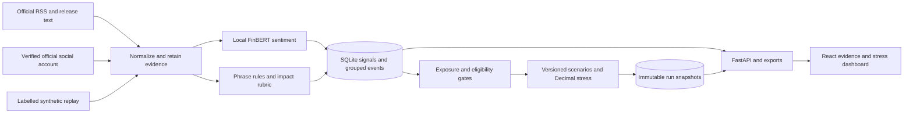

# EventLens

Trace financial text from evidence to structured event intelligence and explained stress results for a fictional wholesale-banking portfolio. EventLens does not forecast losses or recommend trades.

Code to Connect Phase III — S&P Global × Crisil × Naukri Campus.

- Candidate: Abhinav Jain
- College: Vellore Institute of Technology, Bhopal
- College email: abhinav.23bcg10130@vitbhopal.ac.in

## Current status

Phases 1–4 are complete: the backend/dashboard cover two live source adapters, pinned FinBERT, inspectable event/impact rules, a 20-position synthetic portfolio, four versioned scenarios, eligibility/review, automatic live/simulated runs, manual comparisons, SQLite snapshots, replay and JSON/CSV exports. Phase 5 evaluation, regression-first refinement and isolated clean installation have passed their engineering checks; [measured results and limitations](docs/phase5-verification.md) are documented. The seven-slide [presentation PDF](docs/presentation.pdf), [recording guide](docs/recording-guide.md) and [submission checklist](docs/submission-checklist.md) are prepared for review. Candidate label review, walkthrough, published-repository clone verification, notices/naming resolution and recording/submission remain. This is not a validated autonomous risk system or a completed assessment submission.

The RSS and social adapters currently share one publisher, the Federal Reserve Board. Two channels are not independent corroboration. See [risk-engine verification](docs/phase2-verification.md), [stress verification](docs/phase3-verification.md), [dashboard verification](docs/phase4-verification.md), and [math/assumptions](docs/stress-model.md). Provider availability varies; degraded states never substitute fictional evidence.

## Local Quickstart

Use Python 3.12 and Node.js 22.12 or newer (tested here with Node 24). Run commands from the repository root. On Windows, calling the environment's Python directly avoids activation-policy issues.

```powershell
py -3.12 -m venv .venv
.\.venv\Scripts\python.exe -m pip install -r requirements-dev.txt
.\.venv\Scripts\python.exe scripts\download_model.py
Push-Location frontend
npm.cmd ci
npm.cmd run build
Pop-Location
.\.venv\Scripts\python.exe -m uvicorn eventlens.api:app --host 127.0.0.1 --port 8000 --workers 1
```

The one-time setup downloads roughly 418 MiB of model weights, plus Python dependencies. Weights are checksum-verified and stay in `.cache/`, outside Git. Server startup uses only the pinned local cache and makes no model-download request. If it is unavailable, health reports `MODEL_UNAVAILABLE`; analysis returns 503 without fabricated predictions. First-time acquisition needs internet access and can take several minutes or resume after a CDN timeout. An isolated local source export passed fresh environment/install/build/model acquisition and offline end-to-end checks in Phase 5. An actual clone of the published GitHub commit remains a submission gate; the remote is not yet populated.

Open the [dashboard](http://127.0.0.1:8000/) or [interactive API docs](http://127.0.0.1:8000/docs). The built React dashboard and API share one origin and one server. Only `frontend/dist` is served, not project data or runtime files. Build before starting the server; restart if the first frontend build was made after startup. Use one Uvicorn worker: job admission and inference serialization are deliberately single-process.

In the dashboard, load sample events for the reproducible fictional journey, select a rate event, inspect its evidence, and open the saved stress result. Portfolio shows base positions and assumptions; Runs retains independent calculations. Compare scenario requires a saved reason and is always labelled manual. Analyze supplied text is an optional collapsed panel; it cannot turn pasted text into verified live evidence. Refresh live sources never substitutes samples after a provider failure. All displayed dates are UTC.

For frontend development, keep the backend above running and, in a second terminal, run `npm.cmd run dev` from `frontend`. Open `http://127.0.0.1:5173`; Vite proxies `/api` to port 8000. No API token belongs in a Vite environment variable. The optional Access panel holds a write token in page memory only, clearing it on reload. This is local demonstrator access, not a verified public-authentication solution.

In the docs:

1. `POST /api/ingestion/replay` with `{"dataset":"synthetic_events"}` returns an operation ID.
2. `GET /api/operations/{id}` shows completion and counts.
3. `GET /api/events` lists grouped events; `GET /api/events/{id}` exposes evidence and signals.
4. `POST /api/ingestion/refresh` fetches the configured live channels. Each adapter has a persisted five-minute cooldown.
5. `GET /api/exports/signals?format=csv` exports inspectable results. JSON is the default.
6. `GET /api/portfolio` and `GET /api/scenarios` show the synthetic base and assumptions.
7. `GET /api/stress-runs` lists saved results. The replay produces three labelled automatic simulations; repeating it creates no additional runs.
8. `POST /api/stress-runs` creates a manual comparison; `GET /api/stress-runs/{id}` and `GET /api/exports/stress-runs/{id}?format=csv` inspect/export it.

Example manual request (replace `EVENT_ID` with a credit event ID from replay):

```json
{
  "event_id": "EVENT_ID",
  "scenario_id": "credit_deterioration",
  "idempotency_key": "my-credit-comparison-1",
  "impact_score": 8,
  "override_reason": "Fictional issuer-specific comparison; original default signal scores 7."
}
```

Money is returned as decimal strings. Portfolio fair value is $100 million; principal/notional is separately $194.4 million. Rate cuts can produce gains. Every scenario starts from the original base; manual requests cannot claim automatic or verified-source status. Automatic execution waits for a complete successful ingestion batch and applies only to matching eligible events.

`POST /api/signals/analyze` accepts English text and an optional timezone-aware publication timestamp. Supplied text is always unverified user input; it cannot claim official-source provenance. Its language is recorded as undetermined, not detected English. Non-English sentiment/classification is not validated.

## What the engine means

- Sentiment: pretrained `ProsusAI/finbert`, signed score `P(positive) - P(negative)` in [-1, 1]. No project-specific training or independent accuracy claim. The measured PhraseBank diagnostic may overlap model training.
- Event class: conservative English phrase rules (`phrase_rules_v2`), not FinBERT event predictions. Classes include Macroeconomic, Credit Event, Geopolitical, Merger/Acquisition, Product Launch, and Other/Unknown. Archived full-release impact agreement is only 4/12; analyst review and explicit limitations are essential.
- Impact: illustrative rubric `1 + magnitude_points + scope_points`, in [1, 10]. Confirmation and exposure are separate gates. See [scoring rules](docs/scoring-rules.md).
- Evidence: source text, exact matched spans, publication/retrieval times, provenance, model/rule versions, and review reasons are retained.
- Deduplication: canonical publisher/URI grouping preserves each evidence record. Identical text with a different event identity is flagged, not silently merged. Changed content produces a new record/signal version.
- Long text: source inputs are bounded at 12,000 characters. FinBERT uses token-weighted, nonoverlapping 510-token chunks with special tokens, up to 16 chunks. Truncation is explicit. Neither chunk averaging nor softmax outputs are calibrated confidence.

A rate-hike sentence can have positive financial sentiment. Scenario direction comes from the supported subtype and scenario assumptions, not the sentiment sign. Event `eligibility` is evaluated against current evidence, time and portfolio; signal-time reasons remain historical output. Eligibility and actual run status are separate. Read [stress-model notes](docs/stress-model.md) before interpreting a result.



## Verification

```powershell
.\.venv\Scripts\python.exe -m pytest -m "not model and not live" -q
.\.venv\Scripts\python.exe -m pytest -m "not live" --cov=eventlens --cov-branch --cov-report=term-missing
.\.venv\Scripts\python.exe -m ruff check eventlens tests scripts
.\.venv\Scripts\python.exe scripts\phase2_verify.py
.\.venv\Scripts\python.exe scripts\phase2_verify.py --live
.\.venv\Scripts\python.exe scripts\phase3_verify.py
.\.venv\Scripts\python.exe scripts\phase3_verify.py --live
.\.venv\Scripts\python.exe scripts\http_verify.py
Push-Location frontend
npm.cmd run build
npm.cmd run test:coverage
npm.cmd run format:check
npm.cmd exec playwright -- install chromium
npm.cmd run verify:browser
Pop-Location
```

The `model` tests require the real cached model; ordinary unit/API tests inject explicit test doubles, never production fallback predictions. Live verification calls real providers and fails if either required channel fails. Its SQLite database and machine-readable proof remain under ignored `runtime/`. The HTTP check starts an owned loopback server and stops it afterward.

Frontend component tests use explicitly labelled fixtures and mocked HTTP responses. Browser verification starts an owned backend with the real cached model and a unique SQLite database, runs desktop/tablet/mobile journeys and WCAG A/AA axe checks, saves screenshots/CSV/report under `runtime/phase4-browser-*`, and stops its own server afterward. Browser dependencies and initial model downloads require internet; the browser journey also checks both real live providers. Automated accessibility checks are not a complete WCAG certification.

Use `npm.cmd run verify:browser -- --skip-live` when intentionally checking the deterministic browser journey without another provider refresh. Its report explicitly records the live gate as not attempted.

Optional Phase 5 reproduction:

```powershell
.\.venv\Scripts\python.exe scripts\prepare_evaluation.py --archive
.\.venv\Scripts\python.exe scripts\evaluate.py --label refined --include-archive
.\.venv\Scripts\python.exe scripts\clean_setup_verify.py
```

Read the [evaluation contract](docs/evaluation-contract.md) and data-use notices before downloading the optional diagnostic corpus. PhraseBank sentences stay in ignored cache; published [aggregate results](docs/evaluation-results.json) contain no corpus text. Archive labels and development labels are provisional AI drafts awaiting [candidate review](docs/evaluation-review.md). Clean verification exports only publishable source into a new ignored `runtime/phase5-clean-*` directory and installs dependencies/build/model separately; it is not an actual GitHub clone and never commits or pushes.

On Windows, if a shared pytest temporary directory is inaccessible, use a new workspace-local directory rather than deleting unrelated temporary files:

```powershell
New-Item -ItemType Directory -Path .cache/test-runs -Force | Out-Null
$eventlensTestPath = Join-Path (Resolve-Path .cache/test-runs) ([guid]::NewGuid().ToString('N'))
.\.venv\Scripts\python.exe -m pytest --basetemp $eventlensTestPath
```

## Local security and failure behavior

Default binding is loopback, with localhost/127.0.0.1 host checks and explicit same-origin/development-origin writes. Do not expose an unauthenticated model service publicly. Public mode requires `EVENTLENS_PUBLIC=true`, a private `EVENTLENS_WRITE_TOKEN` of at least 24 characters, and an explicit `EVENTLENS_ALLOWED_HOSTS` allowlist. Send the token in `X-EventLens-Token`; never put it in a URL, Git, or a frontend bundle. Public deployment and candidate-facing authentication are not verified yet.

`EVENTLENS_DATABASE` can select another local SQLite file. Source URLs and replay filenames cannot be supplied through the API. Fetching uses fixed approved endpoints, rejects redirects, bounds responses, and retries transient network/5xx failures at most once. A 403 is not retried; a 429 updates cooldown from Retry-After. Provider failures never switch to synthetic data. A partial refresh shows counts and degraded source health while retaining the last successful evidence.

Signals, raw evidence, operation states, source cooldowns and completed stress snapshots survive restarts. Unfinished ingestion operations become `interrupted`; rerun explicitly to resume. Schema version 1 upgrades to 2 without deleting existing evidence. Failed records do not create successful risk signals, and failed calculations do not mutate the base or save a partial result. CSV protects string cells against spreadsheet formula execution; negative numeric financial values remain usable numbers. JSON preserves original evidence.

## Data and attribution

[Synthetic examples](data/synthetic_events.json) are fictional functional inputs, not historical announcements or an evaluation dataset. IDs/content hashes are recalculated by ingestion. The two sample channels for the same fictional rate decision intentionally demonstrate grouping; they do not count as live-source proof.

[Portfolio positions](data/portfolio.csv), [portfolio assumptions](data/portfolio.json), and [scenarios](data/scenarios.json) are also fictional, versioned project data. Changing these files requires new portfolio/scenario versions if an existing database already has those snapshots; silent historical redefinition fails closed at startup.

The pretrained model, libraries, and sources remain third-party work. See [third-party notices](THIRD_PARTY_NOTICES.md). Project code is [MIT licensed](LICENSE). AI-assisted development is used; candidate walkthrough, label review, and final submission checks are still required.

The [project plan](PROJECT_PLAN.md) tracks remaining phases, repository-naming guidance, model notices, and final packaging. Presentation claims distinguish software checks from language evaluation; AI-drafted labels and archive limitations remain visible. The [architecture image](docs/architecture.png) is also available as a static diagram. Recorded-video preparation does not imply a video has been recorded, uploaded or submitted.
